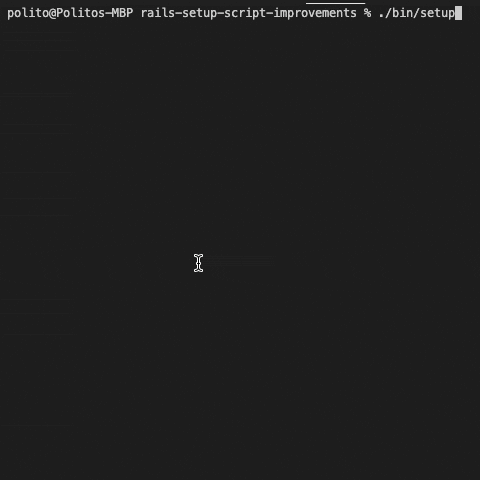

# Rails Setup Script Improvements

Rails ships with a [setup script][] that automates bootstrapping a new application, but did you know that you're free to edit this script? In this quick tutorial, I'll show you how you can improve the default Rails setup script to create a more consistent and helpful onboarding experience for folks on your team.

[setup script]: https://github.com/rails/rails/pull/15189

## Demo

Simply clone this repo and run `./bin/setup`.



## Step 1. Update the Command That Prepares the Database

```diff
--- a/bin/setup
+++ b/bin/setup
@@ -23,7 +23,7 @@ FileUtils.chdir APP_ROOT do
   # end
 
   puts "\n== Preparing database =="
-  system! "bin/rails db:prepare"
+  system! "bin/rails db:reset"
 
   puts "\n== Removing old logs and tempfiles =="
   system! "bin/rails log:clear tmp:clear"
```

> **What's Going On Here?**
>
> Running [bin/rails db:reset][] will do the following:
> 
> 1. Run `bin/rails db:drop`.
> 2. Run `bin/rails db:setup`.
>   - The [bin/rails db:setup][] command will do the following:
>     1. Create the database.
>     2. Load the schema.
>     3. Seed the database.

This ensures the database will always be in the same state after running `./bin/setup`. This is because `bin/rails db:prepare` will not seed the database if the database already exists which could result in inconsistent outcomes.

[bin/rails db:reset]: https://edgeguides.rubyonrails.org/active_record_migrations.html#resetting-the-database
[bin/rails db:setup]: https://edgeguides.rubyonrails.org/active_record_migrations.html#setup-the-database

## Step 2. Create a Job to Seed the Database

```ruby
# app/jobs/database_seeder_job.rb
class DatabaseSeederJob < ApplicationJob
  queue_as :default

  DEFAULT_USER_EMAIL = "user@example.com"
  DEFAULT_USER_PASSWORD = "password"

  def perform
    ActiveRecord::Base.transaction do
      create_default_user
      create_users
      create_posts
    end
  end

  private

  def create_default_user
    User.create!(
      email: DEFAULT_USER_EMAIL,
      password: DEFAULT_USER_PASSWORD,
      password_confirmation: DEFAULT_USER_PASSWORD,
    )
  end

  def create_users
    10.times do |i|
      User.create!(
        email: "user-#{i}@example.com",
        password: DEFAULT_USER_PASSWORD,
        password_confirmation: DEFAULT_USER_PASSWORD,
      )
    end
  end

  def create_posts
    User.all.each_with_index do |user, index|
      Post.create!(
        title: "Title for post #{index}",
        body: "Body for post #{index}",
        user: user
      )
    end
  end
end
```

```ruby
# db/seeds.rb
puts "\n== Seeding database =="
DatabaseSeederJob.perform_now
```

> **What's Going On Here?**
>
> - We could run all the commands from each method inline in `db/seeds.rb`, but that script is run in isolation. By abstracting this into a job, we can call it anywhere within our application. This is important because we'll need access to those constants when we print the instructions to the console.
> - Note that we call `puts` so that we'll know when this part of the setup script is being called.

## Step 3. Print Instructions When Setup is Complete

```ruby
# app/jobs/post_setup_instructions_job.rb
class PostSetupInstructionsJob < ApplicationJob
  queue_as :default

  def perform
    puts "\n== Setup complete! 🎉  =="
    puts "\n👉  Run \"rails s\" to start the development server."
    puts "\n== You can login with the following account  =="
    puts "\n🔗  #{Rails.application.routes.url_helpers.new_user_session_url(host: "localhost", port: 3000)}"
    puts "\📧  Email: #{DatabaseSeederJob::DEFAULT_USER_EMAIL}"
    puts "\🔐  Password: #{DatabaseSeederJob::DEFAULT_USER_PASSWORD}"
    puts "\n"
  end

end
```

```ruby
# lib/tasks/post_setup_instructions.rake
namespace :post_setup_instructions do
  desc "Prints instructions once setup is complete."
  task perform: :environment do
    PostSetupInstructionsJob.perform_now
  end

end
```

```diff
--- a/bin/setup
+++ b/bin/setup
@@ -30,4 +30,6 @@ FileUtils.chdir APP_ROOT do
 
   puts "\n== Restarting application server =="
   system! "bin/rails restart"
+
+  system! "bin/rails post_setup_instructions:perform"
 end
```

> **What's Going On Here?**
>
> - We create `PostSetupInstructionsJob` to print out the instructions for accessing our application. This allows us to access the constants we created in step 2. 
>   - Note that we have to call `Rails.application.routes.url_helpers` to gain access to the [url_for][] method.
>   - You'll also note that we pass in a `host` and `port` as options to avoid raising a `Missing host to link to!` error.
> - We create a `post_setup_instructions` [task][] the calls the `PostSetupInstructionsJob`. This is so we can call it from `./bin/setup`.

[url_for]: https://api.rubyonrails.org//classes/ActionDispatch/Routing/UrlFor.html#method-i-url_for
[task]: https://guides.rubyonrails.org/command_line.html#custom-rake-tasks